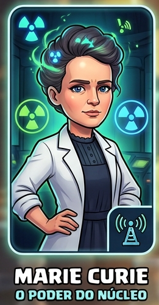
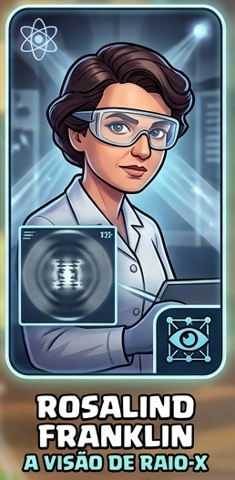
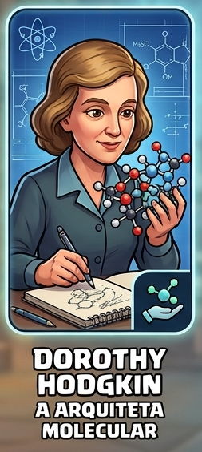
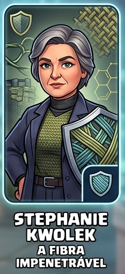
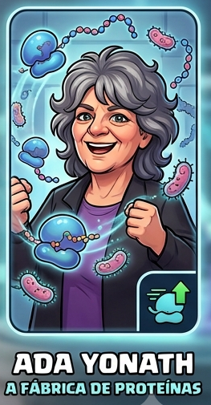

<div align="center">
  
  <h1>🧪 Chemical Royale: A Arena dos Elementos</h1>
  <p><em>Um produto educacional gamificado para a preparação do ENEM — BIO+TECH EDUDESIGN</em></p>
</div>

---

## 📖 Sobre o Projeto

O **Chemical Royale: A Arena dos Elementos** é um ambiente virtual de aprendizagem autoinstrucional, focado no ensino de Química para estudantes do Ensino Médio. Inspirado na mecânica de escolha de heróis e batalhas estratégicas de jogos como Clash Royale, o sistema transforma a resolução de questões do ENEM em uma experiência imersiva, combinando **Gamificação** e **Storytelling**.

Projeto coordenado pela **Prof.ª Pâmella** sob a chancela educacional da **BIO+TECH EDUDESIGN**, desenvolvido em colaboração entre múltiplas IAs especializadas — ver [§9](#-9-fluxo-de-colaboração-multi-ia).

## 🚦 Status do projeto

| Etapa | Arquivo | Status |
|---|---|---|
| 1. Identificação do jogador | `index.html` | ✅ completo |
| 2. Escolha da Líder de Arena | `avatares.html` | ✅ completo |
| 3. Alinhamento pedagógico (BNCC) | `apresentacao.html` | ✅ completo |
| 4. Narrativa + Cenário de Abertura | `narrativa.html` | ✅ completo |
| 5. Lição 17 — O átomo e suas partículas | `licao-17.html` | ⚠️ completo, com bug visual conhecido ([§4](#-4-cartas-de-narrativa-e-ilustrações)) |
| 6. Lição 18 — Tabela periódica e ligações | `licao-18.html` | ✅ completo |
| 7. Lição 19 — Funções inorgânicas + Duelo Final | `licao-19.html` | ⚠️ completo, com o mesmo bug visual ([§4](#-4-cartas-de-narrativa-e-ilustrações)) |
| 8. Economia de PEQ + habilidades passivas funcionais (Sprint 4) | `js/state.js`, `js/licoes-engine.js` | ✅ **implementado** — ver [§7](#-7-sprint-4--economia-de-peq-e-habilidades-passivas-funcionais) |
| 9. Eventos surpresa, leaderboard, badges (Sprint 5) | — | ⏳ não iniciado |
| 10. Painel de pontuação final consolidado + PDF por e-mail (Sprint 5) | — | ⏳ não iniciado |

O arco completo de conteúdo programático (Lições 17–19) está concluído, incluindo o
bloco especial **Duelo Final contra "A Entropia"**, que mescla as três lições como
fechamento narrativo. Desde então, o núcleo de gamificação do **Sprint 4 também foi
implementado** — PEQ (moeda interna) e as 5 habilidades passivas já alteram o
comportamento real dos quizzes, não são mais só texto narrativo. O que resta do
roadmap (Sprint 5: eventos surpresa, leaderboard, badges, PDF por e-mail) segue
não iniciado — ver [§10](#-10-pendências-e-observações-técnicas).

## 🚀 Funcionalidades

- **Identificação de Jogador:** cadastro via e-mail institucional (domínio `@edu.mt.gov.br`), cidade, escola e turma.
- **Líder de Arena:** escolha entre 5 cientistas históricas, cada uma com habilidade passiva própria — **agora funcional em jogo**, não só narrativa (ver [§7](#-7-sprint-4--economia-de-peq-e-habilidades-passivas-funcionais)).
- **Narrativa Interativa:** 3 vertentes de storytelling (Jornada do Herói, In Media Res, Investigativo), com Cenário de Abertura ramificado — ver [§6](#-6-motor-híbrido-do-cenário-de-abertura-narrativahtml).
- **Conteúdo Gamificado:** 3 lições completas (átomo, tabela periódica/ligações, funções inorgânicas), cada uma intercalando teoria, Dialog Cards, um Branching Scenario e blocos de questões padrão ENEM.
- **Duelo Final (fight-boss):** ao fim da Lição 19, um confronto especial com barra de vida, mesclando conteúdo das 3 lições.
- **HUD de Arena:** painel fixo no topo de cada lição, mostrando saldo de PEQ e pontuação em tempo real.
- **Economia de PEQ (Pontos de Energia Química):** moeda interna ganha por dificuldade da questão e pelas habilidades passivas. *(Ainda sem mecânica de gasto/loja — ver [§10](#-10-pendências-e-observações-técnicas).)*
- **Placar progressivo:** pontuação por dificuldade (fácil/médio/difícil), acumulada em todas as lições.
- **Geração de relatório em PDF** (planejada para o Sprint 5): compilado do desempenho e autoavaliação, enviado por e-mail à coordenação.

## 🧬 Liderança de Arena (Avatares)

Antes de iniciar a jornada, o aluno escolhe uma das 5 mulheres notáveis da história da química para guiar sua estratégia. Cada avatar tem uma habilidade passiva única — desde o Sprint 4, essas habilidades **alteram de fato** o resultado dos quizzes (detalhes técnicos em §7):

| Avatar | Especialidade¹ | Habilidade no Jogo |
| :--- | :--- | :--- |
|  | Decaimento Alfa | **O Poder do Núcleo:** a cada 2+ acertos seguidos, +1 PEQ extra por "dano contínuo". |
|  | Análise de Dupla Hélice | **A Visão de Raio-X:** elimina 1 alternativa errada, 1x por lição. |
|  | Cristalização de Insulina | **A Arquiteta Molecular:** todo erro ainda regenera +1 PEQ de consolação. |
|  | Blindagem de Kevlar | **A Fibra Impenetrável:** escudo absorve o 1º erro de cada bloco de quiz (não conta no placar). |
|  | Código Ribossômico | **A Fábrica de Proteínas:** resposta certa em até 10s vale pontuação em dobro. |

> ¹Especialidade relacionada à contribuição histórica dessas mulheres notáveis para o conhecimento científico.

## 📚 Trilha de conteúdo (Lições 17–19)

| Lição | Tema | Tópicos | Questões ENEM |
|---|---|---|---|
| **17** | O átomo e suas partículas | Modelos atômicos, partículas fundamentais, isótopos/isóbaros, configuração eletrônica | 15 |
| **18** | Classificação periódica e ligações químicas | Organização da tabela, propriedades periódicas, ligações químicas, geometria/polaridade/forças intermoleculares | 15 |
| **19** | Funções inorgânicas | Ácidos e bases, sais e óxidos, solubilidade em água | 16 |
| **Duelo Final** | Integração das 3 lições | 4 "golpes" contra A Entropia, mesclando os três pilares | incluso nos 16 da L.19 |

Cada lição segue o mesmo roteiro pedagógico documentado em `docs/esboco-conteudo-licao-*.md`
(teoria → Dialog Cards → questões progressivas fácil/médio/difícil), com um
Branching Scenario adicional na Lição 18 ("Duelo de Elementos").

## 🛠️ Tecnologias Utilizadas

- **Frontend:** HTML5, CSS3, JavaScript puro (sem frameworks, sem build step)
- **Motor de lições próprio:** `js/licoes-engine.js` — reproduz em JS puro os recursos H5P (Course Presentation, Dialog Cards, Branching Scenario, Question Set), sem exigir instalação de nada
- **Ecossistema H5P (opcional):** suportado via `h5p-standalone`, com fallback automático caso não esteja instalado — ver [§6](#-6-motor-híbrido-do-cenário-de-abertura-narrativahtml)
- **Persistência:** `localStorage` (estado do jogador, placar e saldo de PEQ), sem backend
- **Hospedagem:** GitHub Pages
- **Relatórios (planejado, Sprint 5):** biblioteca JS para geração de PDF (ex.: jsPDF)

## 🌐 Como acessar (deploy)

Hospedado via **GitHub Pages**:
👉 `https://bio-tech-edu.github.io/chemical-royale-edu/` *(ativar em Settings → Pages, branch `main`, pasta `/root` — o `.nojekyll` já está incluído)*

> ⚠️ **Atenção — bug conhecido em produção:** os ícones de favicon e o link do
> logo no cabeçalho (`<link rel="icon" ... href="/favicon.ico">`, `<a href="/">`)
> usam caminho **absoluto a partir da raiz do domínio**. Como este é um GitHub
> Project Page (serve a partir de `/chemical-royale-edu/`, não da raiz de
> `bio-tech-edu.github.io`), esses caminhos apontam para o lugar errado em
> produção — o favicon não carrega e o clique no logo tenta ir para
> `bio-tech-edu.github.io/` em vez de voltar para `index.html` do projeto.
> Ver [§10](#-10-pendências-e-observações-técnicas) para o detalhe técnico e a correção sugerida.

## ⚙️ Instalação local

```bash
git clone https://github.com/Bio-Tech-Edu/chemical-royale-edu.git
cd chemical-royale-edu
python -m http.server 8000
```

Acesse `http://localhost:8000` no navegador. Nenhuma dependência precisa ser
instalada — o projeto é 100% estático e o motor de lições não usa build step.

> **Atenção ao abrir os arquivos direto com duplo-clique (`file://`):** o
> Cenário de Abertura da narrativa faz uma checagem via `fetch()` para saber
> se existe conteúdo H5P real instalado. Em alguns navegadores, `fetch()` é
> bloqueado em URLs `file://` por CORS — o que é esperado e **não quebra a
> página**: o motor cai automaticamente no fallback nativo (ver §6). Para uma
> experiência 100% fiel à produção, prefira sempre rodar um servidor local
> (comando acima) a abrir o HTML diretamente.

---

## 📁 Estrutura do repositório

```
chemical-royale-edu/
├── .nojekyll                    → evita que o GitHub Pages ignore pastas iniciadas com "_"
├── LICENSE                      → MIT License
├── README.md                    → este arquivo (vivo, sempre reflete o estado atual)
├── README-Sprint3.md            → snapshot congelado do README ao final do Sprint 3 (histórico, não editar)
├── index.html                   → Etapa 1: Painel de Identificação do Estudante
├── avatares.html                → Etapa 2: Galeria de seleção das 5 Líderes de Arena
├── apresentacao.html            → Etapa 3: Alinhamento pedagógico (BNCC, SAEB, ENEM/INEP)
├── narrativa.html                → Etapa 4: Seleção da vertente narrativa (Cenário de Abertura)
├── licao-17.html                 → Etapa 5a: Lição 17 — O átomo e suas partículas
├── licao-18.html                 → Etapa 5b: Lição 18 — Classificação periódica e ligações
├── licao-19.html                 → Etapa 5c: Lição 19 — Funções inorgânicas + Duelo Final
│
├── .github/
│   ├── claude-instructions.md         → papel do Claude no time multi-IA (narrativa/lógica)
│   ├── copilot-instructions.md        → papel do Copilot (QA, performance, documentação)
│   ├── gemini-instructions.md         → papel do Gemini/Nanobanana (arte e UI/UX)
│   └── plano_desenvolvimento_chemical_royale_v3.md → roadmap detalhado dos Sprints 4-5
│
├── css/
│   └── style.css                 → Design system "Elemento de Arena" (inclui HUD, boss-fight, badges de habilidade)
│
├── js/
│   ├── state.js                  → Estado do jogador (localStorage), catálogos de Avatares/Narrativas, PEQ
│   ├── main.js                   → Lógica do formulário e da galeria de avatares (Sprint 1)
│   ├── narrativa.js              → Seleção de narrativa + motor híbrido do Cenário de Abertura (Sprint 2/3)
│   └── licoes-engine.js          → Motor genérico de lições (diálogo, teoria, dialog cards, branching, quiz, boss-fight, HUD, habilidades passivas, placar)
│
├── data/
│   ├── narrativas.js             → Textos das 3 vertentes narrativas + rotas das lições, para o motor nativo
│   ├── licao-17.js               → Conteúdo estruturado da Lição 17 (slides do licoes-engine.js)
│   ├── licao-18.js               → Conteúdo estruturado da Lição 18
│   └── licao-19.js               → Conteúdo estruturado da Lição 19 + bloco Duelo Final
│
├── docs/
│   ├── esboco-conteudo-licao-17.md   → Roteirização pedagógica completa da Lição 17
│   ├── esboco-conteudo-licao-18.md   → Roteirização pedagógica completa da Lição 18
│   ├── esboco-conteudo-licao-19.md   → Roteirização pedagógica completa da Lição 19 (Duelo Final incluído)
│   └── (2 PDFs de gamificação com nome de arquivo corrompido — ver §10)
│
├── assets/
│   ├── logo/                     → Identidade visual: logo principal, selo BIO+TECH, favicons (ver §2)
│   ├── avatares/                 → Fotos das 5 cientistas
│   ├── cards/                    → Ilustrações das cartas de narrativa + cartas da Lição 17
│   └── moleculas/                → Cartas ilustradas: Forças Intermoleculares (L.18), Modelos Atômicos (L.17), Ácidos do cotidiano (L.19) — ver §4 sobre bug de renderização
│
└── h5p/
    └── dist/                     → Build do h5p-standalone (opcional — ver §6). Vazio por padrão.
```

> A pasta `h5p/branching-narrativa/` (com `content-skeleton.json`) que existia em
> versões anteriores **não está mais no repositório**. Isso não quebra nada — o
> motor híbrido de `narrativa.html` já lida bem com a ausência desses arquivos,
> caindo no fallback nativo — mas significa que, hoje, `data/narrativas.js` é a
> **única** fonte de verdade para os textos das narrativas (ver §6).

## 🚀 1. Configurar o repositório e o GitHub Pages

1. Clone o repositório `Bio-Tech-Edu/chemical-royale-edu`.
2. No GitHub: **Settings → Pages → Build and deployment → Source: Deploy from a branch**,
   selecione a branch `main` e a pasta `/ (root)`.
3. Aguarde o link `https://bio-tech-edu.github.io/chemical-royale-edu/` ficar ativo
   (leva ~1 minuto após o commit).
4. O arquivo `.nojekyll` (vazio) já está na raiz — mantenha-o.

## 🎨 2. Identidade visual BIO+TECH EDUDESIGN

O cabeçalho de todas as páginas usa a arte oficial em `assets/logo/`:
- `chemical_royale_logo.png` — logo principal, com link de volta para a Home (ver bug de caminho absoluto em §10)
- `header_adaptation.png` — selo BIO+TECH EDUDESIGN, no canto do cabeçalho
- Ícones de favicon (`favicon.ico`, `apple-touch-icon.png`, `android-chrome-*.png`) já incluídos, mas com o mesmo bug de caminho absoluto (§10)
- `logo_bio_tech.png` / `logo_bio_tech.jpeg` — arte de referência da marca-mãe BIO+TECH, mantida na pasta mas **não referenciada em nenhuma página** hoje (uso apenas decorativo neste README)

As variáveis de cor da marca ficam no topo de `css/style.css` (`--accent-plasma`,
`--accent-ion`, `--accent-quantum`, `--accent-gold`) — ajuste-as se houver um
manual de marca com paleta fixa.

## 🧑‍🚀 3. Imagens dos avatares

As 5 fotos já estão em `assets/avatares/`, com os nomes referenciados em `js/state.js`
(`marie-curie.png`, `rosalind-franklin.png`, `dorothy-hodgkin.png`, `stephanie-kwolek.png`,
`ada-yonath.png`). Se uma imagem faltar, a carta cai automaticamente no ícone ⚛️ — a
página não quebra.

## 🧩 4. Cartas de narrativa e ilustrações

- `assets/cards/`: `card_a_jornada_do_heroi.png`, `card_in_media_res.png`, `card_investigacao.png` (3 vertentes narrativas) + `card-1_licao_17.png`, `card-2_licao_17.png` (Dialog Cards da Lição 17, tópico Configuração Eletrônica).
- `assets/moleculas/`: 6 cartas ilustradas (frente/verso) de Forças Intermoleculares (Lição 18), 5 cartas de Modelos Atômicos — Dalton, Thomson, Rutherford, Bohr, atual (Lição 17), e 5 cartas de Ácidos do cotidiano (Lição 19).

> ⚠️ **Bug encontrado nesta revisão — cartas de Modelos Atômicos e Ácidos não
> renderizam como imagem.** `data/licao-17.js` e `data/licao-19.js` referenciam
> os 10 arquivos acima usando as chaves `frente:` / `verso:` (formato de texto
> puro), mas `renderDialogCards()` em `js/licoes-engine.js` só trata um card
> como ilustrado quando ele usa as chaves `frenteImg:` / `versoImg:` — exatamente
> como já é feito, corretamente, nas 6 cartas de Forças Intermoleculares da
> Lição 18. Resultado prático: em vez de mostrar a imagem do modelo atômico ou
> do ácido, a carta exibe o **caminho do arquivo como texto literal**
> (ex.: a carta do Dalton mostra a string `assets/moleculas/card-mod-dalton.png`
> em vez do desenho). Nenhuma questão ou avanço de lição é bloqueado por isso —
> é puramente visual — mas afeta 10 cards em 2 lições.
> **Correção:** trocar `frente:`/`verso:` por `frenteImg:`/`versoImg:` (+ um
> `frenteAlt` descritivo) nesses 10 objetos, seguindo o padrão já usado em
> `data/licao-18.js` (linhas ~285-301).

## 🎮 5. Motor de lições

`js/licoes-engine.js` é um motor de "Course Presentation" caseiro, 100% JavaScript
puro (sem dependências externas), que renderiza qualquer lição a partir de um
objeto de dados (`data/licao-17.js`, `data/licao-18.js`, `data/licao-19.js`).
Implementa os 6 tipos de recurso descritos nos esboços pedagógicos
(`docs/esboco-conteudo-licao-*.md`):

| Tipo de slide | O que faz |
|---|---|
| `dialogo` | Fala da Líder de Arena escolhida; no slide de abertura da Lição 17, captura o apelido do aluno |
| `teoria` | Bloco teórico com texto + 1 ou mais figuras |
| `dialog-cards` | Flashcards de autorregulação (texto ou imagem, viram ao clicar) — ver bug em §4 |
| `branching` | Cenário ramificado em nós de decisão, com feedback por alternativa |
| `quiz` | Bloco de questões progressivas (fácil → médio → difícil), com pontuação, PEQ e habilidades passivas (§7) |
| `boss-fight` | Duelo Final com barra de vida do chefão — cada questão respondida desfere um "golpe" (25% de HP), certa ou errada; usado só no encerramento da Lição 19 |
| `final-score` | Placar da lição + mensagem personalizada da avatar |

Regra de gamificação: o aluno só avança de slide se concluir a interação
obrigatória do slide atual (`setGate()` controla esse bloqueio). A única exceção
proposital é o `boss-fight`: nele, toda resposta — certa ou errada — conta como
um golpe válido, para que o arco de 3 lições sempre termine em celebração.

Cada lição HTML (`licao-17.html`, `licao-18.html`, `licao-19.html`) segue sempre
o mesmo padrão mínimo:

```html
<script src="js/state.js"></script>
<script src="js/licoes-engine.js"></script>
<script src="data/licao-XX.js"></script>
<script>
  CRState.requireStudent("index.html");
  CRState.requireAvatar("avatares.html");
  if(!CRState.getNarrative()){ window.location.href = "narrativa.html"; }
  new CRLessonEngine(document.getElementById("lesson-root"), LICAO_XX);
</script>
```

## 🧵 6. Motor híbrido do Cenário de Abertura (`narrativa.html`)

`narrativa.html` usa um **motor híbrido de duas camadas** para o Cenário de
Abertura que aparece depois que o aluno escolhe sua vertente narrativa:

1. **Camada H5P (opcional, "de verdade"):** se `h5p/dist/main.bundle.js` existir
   *e* um pacote `h5p/branching-narrativa/<narrativeId>/h5p.json` também existir,
   `js/narrativa.js` carrega o player h5p-standalone dinamicamente e monta o
   Branching Scenario autorado no editor. **Hoje nenhum dos dois existe no
   repositório** (a pasta `h5p/branching-narrativa/` foi removida — ver nota na
   estrutura de pastas acima), então esta camada nunca é acionada em produção;
   ela só existe como capacidade futura, caso a equipe queira portabilidade para
   outro LMS compatível com H5P.
2. **Camada nativa (é o que roda hoje, sempre):** como a Camada 1 nunca está
   disponível no estado atual do repositório, `js/narrativa.js` sempre renderiza
   a cena pelo motor nativo — **o mesmo padrão visual do `renderBranching()`**
   (bolha de diálogo da Líder de Arena + bloco de decisão com opções e
   feedback), com os textos de `data/narrativas.js`. Não depende de npm, CDN
   nem autoria externa.

O aluno nunca vê qual camada está rodando; a experiência é idêntica nas duas.

### Para reativar a Camada 1 (H5P real) no futuro

```bash
npm install h5p-standalone
cp -r node_modules/h5p-standalone/dist h5p/dist
```

Como o antigo `content-skeleton.json` não existe mais, use `data/narrativas.js`
como roteiro de texto ao autorar no editor gratuito **Lumi**
(https://lumi.education) ou na conta H5P.org — ele já está mais completo que o
skeleton original (inclui a primeira ramificação, não só a tela de abertura).
Exporte cada narrativa como `.h5p`, extraia para
`h5p/branching-narrativa/jornada-heroi/`, `.../in-media-res/`,
`.../investigativo/` (cada pasta precisa de `h5p.json` e `content/content.json`).
`js/narrativa.js` detecta os arquivos automaticamente — nenhuma mudança de
código é necessária.

## 🧪 7. Sprint 4 — Economia de PEQ e Habilidades Passivas Funcionais

Diferente do que versões anteriores deste README indicavam, **o núcleo do
Sprint 4 já está implementado** em `js/state.js` e `js/licoes-engine.js`.

### PEQ (Pontos de Energia Química)

Moeda interna do jogo, persistida em `localStorage` junto ao resto do estado.

- `CRState.getPEQ()` / `CRState.atualizarPEQ(quantidade)` — leitura e escrita, nunca fica negativo.
- Toda resposta correta em um `quiz` concede PEQ proporcional à dificuldade automaticamente, via `registrarResposta(correta, pontosBase, dificuldade)`: **fácil = 1, média = 2, difícil = 3**.
- Exibido em tempo real no **HUD de Arena** (`#arena-hud`) fixo no topo de cada lição, junto com a pontuação acumulada.
- **Ainda não tem mecânica de gasto** (loja, upgrades, resgate) — hoje é só acúmulo. Isso é esperado: o plano v3 (`.github/plano_desenvolvimento_chemical_royale_v3.md`) não previa uma loja explícita, mas se a intenção pedagógica for dar um "propósito" ao PEQ além do saldo visível, é uma decisão de design em aberto.

### Habilidades passivas (efeito real, não só narrativo)

Implementadas em duas funções de `js/licoes-engine.js`, chamadas pelo motor de
quiz e pelo Duelo Final:

- **`aplicarRaioXSeDisponivel(q)`** — só a Rosalind Franklin usa: elimina 1 alternativa incorreta ao renderizar uma pergunta, uma única vez por lição.
- **`aplicarHabilidadeNaResposta(...)`** — chamada ao resolver qualquer resposta:
  - **Marie Curie:** sequência de 2+ acertos seguidos rende +1 PEQ extra por rodada; qualquer erro reinicia a sequência.
  - **Stephanie Kwolek:** um escudo absorve o 1º erro de cada bloco de quiz — não entra na contagem de erros do placar.
  - **Dorothy Hodgkin:** todo erro ainda regenera +1 PEQ de consolação.
  - **Ada Yonath:** acerto respondido em até 10s dobra a pontuação daquela questão.

O feedback de cada habilidade aparece como uma nota narrativa junto ao feedback
padrão da questão (ex.: *"⚛️ Faísca radioativa! +1 PEQ extra..."*), conciliando
tanto a diretriz do Copilot (efeito funcional, não decorativo) quanto a do
Claude (feedback narrativo, não técnico) em `.github/*-instructions.md`.

### O que falta para fechar o Sprint 4 por completo

Comparando com `.github/plano_desenvolvimento_chemical_royale_v3.md`:

- [x] Sistema de PEQ com ganho por dificuldade
- [x] Habilidades passivas funcionais das 5 avatares
- [x] HUD fixo exibindo placar + PEQ
- [ ] Eventos surpresa ("É fato ou fake?") — não iniciado, fica para o Sprint 5 nesta revisão
- [ ] Leaderboard local + sistema de conquistas/badges — não iniciado

## 🔗 8. Fluxo de telas e estado do jogador

```
index.html (Identificação)
   → avatares.html (Escolha da Líder de Arena)
      → apresentacao.html (Alinhamento pedagógico / BNCC)
         → narrativa.html (Narrativa + Cenário de Abertura híbrido)
            → licao-17.html (O átomo e suas partículas)
               → licao-18.html (Classificação periódica e ligações)
                  → licao-19.html (Funções inorgânicas + Duelo Final)
                     → narrativa.html (hub — painel de pontuação final chega no Sprint 5)
```

Todo o estado (`student`, `avatarId`, `narrativeId`, `apelido`, `score`, `peq`,
`licoesConcluidas`) fica em `localStorage` sob a chave
`chemicalRoyale.playerState.v1`, gerenciado por `js/state.js` (objeto
`CRState`). Cada página valida com `CRState.requireStudent()` /
`CRState.requireAvatar()` se as etapas anteriores foram concluídas,
redirecionando o aluno de volta se necessário.

## ♿ Acessibilidade e responsividade

- Mobile-first: grades reorganizam de 1 → 2 → 3/5 colunas conforme a largura.
- Foco de teclado visível em todos os elementos interativos.
- `prefers-reduced-motion` respeitado globalmente.
- Cartas de avatar/narrativa/lição são `<button>` reais (não `<div>` clicável),
  com `aria-pressed` e `aria-label` descritivos.

## 🧹 9. Fluxo de colaboração multi-IA

O projeto é desenvolvido por um time de IAs especializadas, coordenado por
Manus AI como Product Owner (chancela BIO+TECH EDUDESIGN), com papéis fixos
documentados em `.github/`:

| IA | Papel | Instruções |
|---|---|---|
| Claude | Storytelling, lógica de interação, engajamento social/narrativo | `.github/claude-instructions.md` |
| GitHub Copilot | QA, performance, documentação técnica (JSDoc, READMEs) | `.github/copilot-instructions.md` |
| Gemini / Nanobanana | Direção de arte, assets visuais, UI/UX | `.github/gemini-instructions.md` |

O roadmap detalhado dos Sprints 4 e 5 — incluindo os prompts sugeridos para
cada tarefa — está em `.github/plano_desenvolvimento_chemical_royale_v3.md`.
Este README é o documento vivo que reflete **o que já foi de fato integrado ao
código**, não o planejamento; para o planejamento, consulte o arquivo acima.

## 📌 10. Pendências e observações técnicas

Achados desta revisão que não bloqueiam o uso do projeto, mas merecem atenção:

1. **Bug de caminho absoluto no favicon e no link do logo.** `index.html` (e as
   demais páginas) usam `href="/favicon.ico"` e `<a href="/">` — caminhos
   absolutos a partir da raiz do domínio. Como o deploy é um GitHub *Project
   Page* (`bio-tech-edu.github.io/chemical-royale-edu/`, não a raiz do domínio),
   o favicon não carrega em produção e o clique no logo tenta sair do projeto.
   **Correção sugerida:** trocar para caminhos relativos (`href="favicon.ico"`,
   `<a href="index.html">`) ou usar `<base href="/chemical-royale-edu/">` no
   `<head>` de todas as páginas.
2. **Dialog Cards de Modelos Atômicos (L.17) e Ácidos (L.19) não renderizam
   como imagem** — detalhado em §4. Afeta 10 cards em 2 lições; correção é
   trocar `frente`/`verso` por `frenteImg`/`versoImg` nos dois arquivos de dados.
3. **`desktop.ini` versionado na raiz do repositório.** É um artefato do
   Windows Explorer (gerado ao configurar o ícone de uma pasta local), não tem
   função no projeto e não deveria estar no Git. Sugestão: remover o arquivo e
   adicionar `desktop.ini` ao `.gitignore`.
4. **Dois PDFs em `docs/` com nome de arquivo corrompido** (`Gamifica#U00e7...`,
   `Gamifica#U251c#U00ba...` — mojibake, provavelmente de um upload/zip com
   encoding UTF-8 × CP437 conflitante). Os dois nomes sugerem o mesmo documento
   duplicado com corrupções diferentes. Sugestão: confirmar se é um único PDF
   de referência, renomear para algo como `docs/gamificacao-pre-enem-digital.pdf`
   e remover a duplicata.
5. **Pasta `h5p/branching-narrativa/` removida** sem que o motor híbrido (§6)
   fosse afetado — o fallback nativo assume 100% da experiência hoje. Não é um
   bug (o site funciona normalmente), mas reduz a Camada 1 do motor híbrido a
   uma capacidade teórica até que alguém autore o conteúdo novamente.
6. **PEQ ainda sem mecânica de gasto** — ver nota em §7.

## 📧 Contato e suporte

Para dúvidas pedagógicas e suporte em relação ao conteúdo:
**Prof.ª Pâmella** — pamella.balcacar@edu.mt.gov.br

---

**Próximos sprints (Sprint 5, conforme `.github/plano_desenvolvimento_chemical_royale_v3.md`):**
eventos surpresa ("É fato ou fake?"), leaderboard local + sistema de badges/conquistas,
painel de pontuação final consolidado, autoavaliação e geração de PDF por e-mail
(jsPDF + EmailJS). Ver §10 para a lista de correções técnicas recomendadas antes
ou durante esse próximo sprint.

<div align="center">
  
</div>
