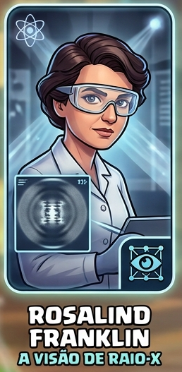
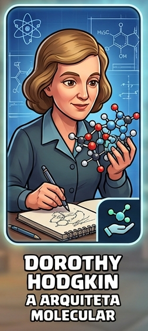
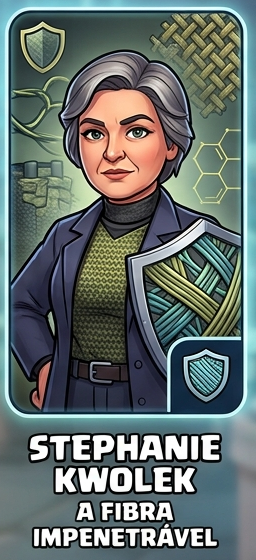

<div align="center">
  
  <h1>🧪 Chemical Royale: A Arena dos Elementos</h1>
  <p><em>Um produto educacional gamificado para a preparação do ENEM — BIO+TECH EDUDESIGN</em></p>
</div>

---

## 📖 Sobre o Projeto

O **Chemical Royale: A Arena dos Elementos** é um ambiente virtual de aprendizagem autoinstrucional, focado no ensino de Química para estudantes do Ensino Médio. Inspirado na mecânica de escolha de heróis e batalhas estratégicas de jogos como Clash Royale, o sistema transforma a resolução de questões do ENEM em uma experiência imersiva, combinando **Gamificação** e **Storytelling**.

Projeto coordenado pela **Prof.ª Pâmella** sob a chancela educacional da **BIO+TECH EDUDESIGN**, desenvolvido em colaboração entre múltiplas IAs especializadas — ver [§9](#-9-fluxo-de-colaboração-multi-ia).

## 🚦 Status do projeto

| Etapa | Arquivo | Status |
|---|---|---|
| 1. Identificação do jogador | `index.html` | ✅ completo |
| 2. Escolha da Líder de Arena | `avatares.html` | ✅ completo |
| 3. Alinhamento pedagógico (BNCC) | `apresentacao.html` | ✅ completo |
| 4. Narrativa + Cenário de Abertura | `narrativa.html` | ✅ completo |
| 5. Lição 17 — O átomo e suas partículas | `licao-17.html` | ⚠️ completo, com bug visual conhecido ([§4](#-4-cartas-de-narrativa-e-ilustrações)) |
| 6. Lição 18 — Tabela periódica e ligações | `licao-18.html` | ✅ completo |
| 7. Lição 19 — Funções inorgânicas + Duelo Final | `licao-19.html` | ⚠️ completo, com o mesmo bug visual ([§4](#-4-cartas-de-narrativa-e-ilustrações)) |
| 8. Economia de PEQ + habilidades passivas funcionais (Sprint 4) | `js/state.js`, `js/licoes-engine.js` | ✅ implementado — ver [§7](#-7-sprint-4--economia-de-peq-e-habilidades-passivas-funcionais) |
| 9. **Evento surpresa "É fato ou fake?" (Sprint 5, tarefa 1/3)** | `data/eventos-fato-fake.js`, `js/licoes-engine.js` (slide `fato-fake`) | ✅ **implementado nesta entrega** — ver [§11](#-11-sprint-5--evento-surpresa-é-fato-ou-fake-entrega-atual) |
| 10. Leaderboard local + badges (Sprint 5, tarefa 2/3) | — | ⏳ não iniciado |
| 11. Painel de pontuação final consolidado + PDF por e-mail (Sprint 5, tarefa 3/3) | — | ⏳ não iniciado |

O arco completo de conteúdo programático (Lições 17–19) está concluído, incluindo o
bloco especial **Duelo Final contra "A Entropia"**. O **Sprint 4 (economia de PEQ +
habilidades passivas)** já estava implementado, e nesta entrega o **primeiro
componente do Sprint 5 — Evento Surpresa "É fato ou fake?" — foi entregue** e
integrado às 3 lições ([§11](#-11-sprint-5--evento-surpresa-é-fato-ou-fake-entrega-atual)).
Além disso, o **bug §10.1 (caminhos absolutos de favicon/logo) foi corrigido**
em todas as 7 páginas, junto de um bug adicional detectado em `data/licao-17.js`
([§10.1 e §10.2](#-10-pendências-e-observações-técnicas)).
O que resta do roadmap (leaderboard, badges e PDF por e-mail) segue não iniciado.

## 🚀 Funcionalidades

- **Identificação de Jogador:** cadastro via e-mail institucional (domínio `@edu.mt.gov.br`), cidade, escola e turma.
- **Líder de Arena:** escolha entre 5 cientistas históricas, cada uma com habilidade passiva própria — funcional em jogo, não só narrativa (ver [§7](#-7-sprint-4--economia-de-peq-e-habilidades-passivas-funcionais)).
- **Narrativa Interativa:** 3 vertentes de storytelling (Jornada do Herói, In Media Res, Investigativo), com Cenário de Abertura ramificado — ver [§6](#-6-motor-híbrido-do-cenário-de-abertura-narrativahtml).
- **Conteúdo Gamificado:** 3 lições completas (átomo, tabela periódica/ligações, funções inorgânicas), cada uma intercalando teoria, Dialog Cards, um Branching Scenario e blocos de questões padrão ENEM.
- **Duelo Final (fight-boss):** ao fim da Lição 19, um confronto especial com barra de vida, mesclando conteúdo das 3 lições.
- **Evento surpresa "É fato ou fake?" (Sprint 5):** slide-relâmpago que interrompe o fluxo da lição com uma afirmação química de senso comum e 15s para julgar como FATO ou FAKE — ver [§11](#-11-sprint-5--evento-surpresa-é-fato-ou-fake-entrega-atual).
- **HUD de Arena:** painel fixo no topo de cada lição, mostrando saldo de PEQ e pontuação em tempo real.
- **Economia de PEQ (Pontos de Energia Química):** moeda interna ganha por dificuldade da questão, pelas habilidades passivas e agora também pelo Evento Surpresa. *(Ainda sem mecânica de gasto/loja — ver [§10](#-10-pendências-e-observações-técnicas).)*
- **Placar progressivo:** pontuação por dificuldade (fácil/médio/difícil), acumulada em todas as lições.
- **Geração de relatório em PDF** (planejada para o Sprint 5 — não iniciada): compilado do desempenho e autoavaliação, enviado por e-mail à coordenação.

## 🧬 Liderança de Arena (Avatares)

Antes de iniciar a jornada, o aluno escolhe uma das 5 mulheres notáveis da história da química para guiar sua estratégia. Cada avatar tem uma habilidade passiva única — desde o Sprint 4, essas habilidades **alteram de fato** o resultado dos quizzes (detalhes técnicos em §7):

| Avatar | Especialidade¹ | Habilidade no Jogo |
| :--- | :--- | :--- |
|  | Decaimento Alfa | **O Poder do Núcleo:** a cada 2+ acertos seguidos, +1 PEQ extra por "dano contínuo". |
|  | Análise de Dupla Hélice | **A Visão de Raio-X:** elimina 1 alternativa errada, 1x por lição. |
|  | Cristalização de Insulina | **A Arquiteta Molecular:** todo erro ainda regenera +1 PEQ de consolação. |
|  | Blindagem de Kevlar | **A Fibra Impenetrável:** escudo absorve o 1º erro de cada bloco de quiz (não conta no placar). |
|  | Código Ribossômico | **A Fábrica de Proteínas:** resposta certa em até 10s vale pontuação em dobro. |

> ¹Especialidade relacionada à contribuição histórica dessas mulheres notáveis para o conhecimento científico.

## 📚 Trilha de conteúdo (Lições 17–19)

| Lição | Tema | Tópicos | Questões ENEM |
|---|---|---|---|
| **17** | O átomo e suas partículas | Modelos atômicos, partículas fundamentais, isótopos/isóbaros, configuração eletrônica | 15 |
| **18** | Classificação periódica e ligações químicas | Organização da tabela, propriedades periódicas, ligações químicas, geometria/polaridade/forças intermoleculares | 15 |
| **19** | Funções inorgânicas | Ácidos e bases, sais e óxidos, solubilidade em água | 16 |
| **Duelo Final** | Integração das 3 lições | 4 "golpes" contra A Entropia, mesclando os três pilares | incluso nos 16 da L.19 |

Cada lição segue o mesmo roteiro pedagógico documentado em `docs/esboco-conteudo-licao-*.md`
(teoria → Dialog Cards → questões progressivas fácil/médio/difícil), com um
Branching Scenario adicional na Lição 18 ("Duelo de Elementos") e — desde esta
entrega — um **Evento Surpresa "É fato ou fake?"** injetado antes da Revisão
Geral de cada lição.

## 🛠️ Tecnologias Utilizadas

- **Frontend:** HTML5, CSS3, JavaScript puro (sem frameworks, sem build step)
- **Motor de lições próprio:** `js/licoes-engine.js` — reproduz em JS puro os recursos H5P (Course Presentation, Dialog Cards, Branching Scenario, Question Set), sem exigir instalação de nada. Desde esta entrega, também renderiza o novo slide type `fato-fake` (§11).
- **Ecossistema H5P (opcional):** suportado via `h5p-standalone`, com fallback automático caso não esteja instalado — ver [§6](#-6-motor-híbrido-do-cenário-de-abertura-narrativahtml)
- **Persistência:** `localStorage` (estado do jogador, placar, saldo de PEQ e estatística de Fatos/Fakes), sem backend
- **Hospedagem:** GitHub Pages
- **Relatórios (planejado, Sprint 5):** biblioteca JS para geração de PDF (ex.: jsPDF)

## 🌐 Como acessar (deploy)

Hospedado via **GitHub Pages**:
👉 `https://bio-tech-edu.github.io/chemical-royale-edu/` *(ativar em Settings → Pages, branch `main`, pasta `/root` — o `.nojekyll` já está incluído)*

> ✅ **Bug de caminho absoluto do favicon/logo — CORRIGIDO nesta entrega.**
> As referências `<link rel="icon" ... href="/favicon.ico">` e `<a href="/">`,
> que apontavam para a raiz do domínio, foram substituídas por caminhos
> **relativos** (`assets/logo/favicon.ico`, `index.html`) em todas as 7 páginas.
> Agora o favicon carrega e o logo volta corretamente para o `index.html` do
> projeto tanto em `localhost` quanto em produção
> (`bio-tech-edu.github.io/chemical-royale-edu/`). Detalhes em [§10](#-10-pendências-e-observações-técnicas).

## ⚙️ Instalação local

```bash
git clone https://github.com/Bio-Tech-Edu/chemical-royale-edu.git
cd chemical-royale-edu
python -m http.server 8000
```

Acesse `http://localhost:8000` no navegador. Nenhuma dependência precisa ser
instalada — o projeto é 100% estático e o motor de lições não usa build step.

> **Atenção ao abrir os arquivos direto com duplo-clique (`file://`):** o
> Cenário de Abertura da narrativa faz uma checagem via `fetch()` para saber
> se existe conteúdo H5P real instalado. Em alguns navegadores, `fetch()` é
> bloqueado em URLs `file://` por CORS — o que é esperado e **não quebra a
> página**: o motor cai automaticamente no fallback nativo (ver §6). Para uma
> experiência 100% fiel à produção, prefira sempre rodar um servidor local
> (comando acima) a abrir o HTML diretamente.

---

## 📁 Estrutura do repositório

```
chemical-royale-edu/
├── .nojekyll                    → evita que o GitHub Pages ignore pastas iniciadas com "_"
├── LICENSE                      → MIT License
├── README.md                    → este arquivo (vivo, sempre reflete o estado atual)
├── index.html                   → Etapa 1: Painel de Identificação do Estudante
├── avatares.html                → Etapa 2: Galeria de seleção das 5 Líderes de Arena
├── apresentacao.html            → Etapa 3: Alinhamento pedagógico (BNCC, SAEB, ENEM/INEP)
├── narrativa.html               → Etapa 4: Seleção da vertente narrativa (Cenário de Abertura)
├── licao-17.html                → Etapa 5a: Lição 17 — O átomo e suas partículas
├── licao-18.html                → Etapa 5b: Lição 18 — Classificação periódica e ligações
├── licao-19.html                → Etapa 5c: Lição 19 — Funções inorgânicas + Duelo Final
│
├── .github/
│   ├── claude-instructions.md         → papel do Claude no time multi-IA (narrativa/lógica)
│   ├── copilot-instructions.md        → papel do Copilot (QA, performance, documentação)
│   ├── gemini-instructions.md         → papel do Gemini/Nanobanana (arte e UI/UX)
│   └── plano_desenvolvimento_chemical_royale_v3.md → roadmap detalhado dos Sprints 4–5
│
├── css/
│   └── style.css                 → Design system "Elemento de Arena" (inclui HUD, boss-fight, badges de habilidade e o bloco "É fato ou fake?" — §11)
│
├── js/
│   ├── state.js                  → Estado do jogador (localStorage), catálogos de Avatares/Narrativas, PEQ, estatística de Fatos/Fakes (§11)
│   ├── main.js                   → Lógica do formulário e da galeria de avatares (Sprint 1)
│   ├── narrativa.js              → Seleção de narrativa + motor híbrido do Cenário de Abertura (Sprint 2/3)
│   └── licoes-engine.js          → Motor genérico de lições (diálogo, teoria, dialog cards, branching, quiz, fato-fake §11, boss-fight, HUD, habilidades passivas, placar)
│
├── data/
│   ├── narrativas.js             → Textos das 3 vertentes narrativas + rotas das lições, para o motor nativo
│   ├── licao-17.js               → Conteúdo estruturado da Lição 17 (agora com slide fato-fake antes da Revisão Geral)
│   ├── licao-18.js               → Conteúdo estruturado da Lição 18 (idem)
│   ├── licao-19.js               → Conteúdo estruturado da Lição 19 + bloco Duelo Final (idem)
│   └── eventos-fato-fake.js      → Banco temático de afirmações + helper sortearFatoFake() — §11
│
├── docs/
│   ├── esboco-conteudo-licao-17.md   → Roteirização pedagógica completa da Lição 17
│   ├── esboco-conteudo-licao-18.md   → Roteirização pedagógica completa da Lição 18
│   ├── esboco-conteudo-licao-19.md   → Roteirização pedagógica completa da Lição 19 (Duelo Final incluído)
│   └── (2 PDFs de gamificação com nome de arquivo corrompido — ver §10)
│
├── assets/
│   ├── logo/                     → Identidade visual: logo principal, selo BIO+TECH, favicons (ver §2)
│   ├── avatares/                 → Fotos das 5 cientistas
│   ├── cards/                    → Ilustrações das cartas de narrativa + cartas da Lição 17
│   └── moleculas/                → Cartas ilustradas: Forças Intermoleculares (L.18), Modelos Atômicos (L.17), Ácidos do cotidiano (L.19) — ver §4 sobre bug de renderização
│
└── h5p/
    └── dist/                     → Build do h5p-standalone (opcional — ver §6). Vazio por padrão.
```

## 🚀 1. Configurar o repositório e o GitHub Pages

1. Clone o repositório `Bio-Tech-Edu/chemical-royale-edu`.
2. No GitHub: **Settings → Pages → Build and deployment → Source: Deploy from a branch**,
   selecione a branch `main` e a pasta `/ (root)`.
3. Aguarde o link `https://bio-tech-edu.github.io/chemical-royale-edu/` ficar ativo
   (leva ~1 minuto após o commit).
4. O arquivo `.nojekyll` (vazio) já está na raiz — mantenha-o.

## 🎨 2. Identidade visual BIO+TECH EDUDESIGN

O cabeçalho de todas as páginas usa a arte oficial em `assets/logo/`:
- `chemical_royale_logo.png` — logo principal, com link relativo para `index.html` (bug de caminho absoluto **corrigido** nesta entrega — §10.1)
- `header_adaptation.png` — selo BIO+TECH EDUDESIGN, no canto do cabeçalho
- Ícones de favicon (`favicon.ico`, `apple-touch-icon.png`, `android-chrome-*.png`) já incluídos, agora com **caminhos relativos** e `type` MIME correto (§10.1)
- `logo_bio_tech.png` / `logo_bio_tech.jpeg` — arte de referência da marca-mãe BIO+TECH, mantida na pasta mas **não referenciada em nenhuma página** hoje (uso apenas decorativo neste README)

As variáveis de cor da marca ficam no topo de `css/style.css` (`--accent-plasma`,
`--accent-ion`, `--accent-quantum`, `--accent-gold`) — ajuste-as se houver um
manual de marca com paleta fixa.

## 🧑‍🚀 3. Imagens dos avatares

As 5 fotos já estão em `assets/avatares/`, com os nomes referenciados em `js/state.js`.
Se uma imagem faltar, a carta cai automaticamente no ícone ⚛️ — a página não quebra.

## 🧩 4. Cartas de narrativa e ilustrações

- `assets/cards/`: 3 vertentes narrativas + Dialog Cards da Lição 17 (Configuração Eletrônica).
- `assets/moleculas/`: 6 cartas de Forças Intermoleculares (L.18), 5 de Modelos Atômicos (L.17) e 5 de Ácidos do cotidiano (L.19).

> ⚠️ **Bug pendente (não corrigido nesta entrega, mas documentado):** Dialog Cards
> de Modelos Atômicos (L.17) e Ácidos (L.19) usam as chaves `frente:`/`verso:`,
> quando o motor só renderiza imagens com `frenteImg:`/`versoImg:`. Ficará para a
> próxima entrega, conforme escopo desta iteração (foco: bug do favicon + evento
> surpresa).

## 🎮 5. Motor de lições

`js/licoes-engine.js` renderiza qualquer lição a partir de um objeto de dados
(`data/licao-*.js`), reproduzindo os recursos H5P em JS puro. Slides suportados:

| Slide type       | Uso                                                                 |
|------------------|---------------------------------------------------------------------|
| `dialogo`        | Balão de fala da Líder de Arena (opcionalmente pergunta o apelido). |
| `teoria`         | Bloco de explicação com título, parágrafos e figura opcional.       |
| `dialog-cards`   | Flashcards frente/verso (texto ou imagem).                          |
| `branching`      | Cenário ramificado com nós de decisão.                              |
| `quiz`           | Bloco de 3 questões F/M/D com feedback rico.                        |
| **`fato-fake`**  | **NOVO (Sprint 5):** evento surpresa cronometrado — §11.            |
| `boss-fight`     | Duelo Final com barra de vida do chefão.                            |
| `final-score`    | Painel de pontuação/PEQ ao fim da lição.                            |

## 🌐 6. Motor híbrido do Cenário de Abertura (`narrativa.html`)

O motor de `narrativa.js` primeiro tenta carregar um pacote H5P real
(`h5p/branching-narrativa/`); se não existir, cai no fallback nativo em JS puro,
lendo diretamente `data/narrativas.js`. Hoje a pasta H5P não está no repositório,
então o motor nativo assume 100% da experiência — o comportamento é idêntico ao
usuário final.

## 🧪 7. Sprint 4 — Economia de PEQ e Habilidades Passivas Funcionais

**Status:** ✅ implementado (não faz parte desta entrega, mas segue como fundação
para o Sprint 5).

- **PEQ (Pontos de Energia Química):** moeda interna, persistida em `localStorage`.
  Ganho automático por resposta correta: fácil = 1, média = 2, difícil = 3 PEQ.
- **Habilidades passivas com efeito real** (via `aplicarHabilidadeNaResposta` e
  `aplicarRaioXSeDisponivel` em `js/licoes-engine.js`):
  Rosalind Franklin (elimina 1 alternativa errada), Marie Curie (+1 PEQ em streak
  de 2+), Stephanie Kwolek (escudo no 1º erro), Dorothy Hodgkin (+1 PEQ em erros),
  Ada Yonath (pontuação em dobro se ≤ 10s).

## 🔗 8. Fluxo de telas e estado do jogador

`index.html` → `avatares.html` → `apresentacao.html` → `narrativa.html` →
`licao-17.html` → `licao-18.html` → `licao-19.html` (Duelo Final) →
`narrativa.html` (hub — painel final chega em uma iteração futura do Sprint 5).

Todo o estado fica em `localStorage` sob a chave
`chemicalRoyale.playerState.v1`: `student`, `avatarId`, `narrativeId`,
`apelido`, `score`, `peq`, `licoesConcluidas` e — desde esta entrega —
`fatosFake` (§11).

## 🤖 9. Fluxo de colaboração multi-IA

Time coordenado por **Manus AI** (Product Owner, BIO+TECH EDUDESIGN):
- **Claude:** storytelling, lógica de interação, engajamento narrativo (esta
  entrega: correção do bug §10.1 + implementação do evento surpresa §11).
- **GitHub Copilot:** QA, performance, documentação (JSDoc, READMEs).
- **Gemini / Nanobanana:** direção de arte, assets visuais, UI/UX.

## 📌 10. Pendências e observações técnicas

1. ~~**Bug de caminho absoluto no favicon e no link do logo.**~~ ✅ **Corrigido
   nesta entrega.** Todas as 7 páginas HTML (`index`, `avatares`, `apresentacao`,
   `narrativa`, `licao-17`, `licao-18`, `licao-19`) agora usam caminhos
   relativos (`assets/logo/favicon.ico`, `index.html`) e o atributo `type` dos
   `<link rel="icon">` foi corrigido para MIME types válidos (`image/x-icon`,
   `image/png`). Favicon e logo funcionam idênticos em `localhost:8000` e em
   `bio-tech-edu.github.io/chemical-royale-edu/`. Validação: `grep 'href="/"'
   *.html` retorna zero ocorrências.

2. **Bug adicional detectado e corrigido nesta entrega:** `data/licao-17.js`
   tinha um atributo HTML (`width="200"`) invadindo o objeto JS na figura de Bohr
   (linha 41), o que quebrava o parse do módulo (SyntaxError em `node --check`).
   Refatorado para `src`/`width`/`alt` como propriedades JS válidas. Sem esse
   fix, o Evento Surpresa injetado na Lição 17 nem chegaria a rodar.

3. **Dialog Cards de Modelos Atômicos (L.17) e Ácidos (L.19) não renderizam como
   imagem** — trocar `frente/verso` por `frenteImg/versoImg`. Ainda pendente
   (fora do escopo desta entrega).

4. `desktop.ini` versionado na raiz — remover do repositório e adicionar ao
   `.gitignore`. Ainda pendente.

5. Dois PDFs em `docs/` com nome de arquivo corrompido (mojibake) — renomear e
   remover duplicata. Ainda pendente.

6. **PEQ ainda sem mecânica de gasto** — projetado para virar loja de "reagentes"
   ou upgrades de habilidade em iteração futura do Sprint 5.

7. **Sprint 5 restante:** leaderboard local + badges de conquista, painel final
   consolidado, exportação em PDF (jsPDF) com envio por e-mail (EmailJS).

---

## 🎲 11. Sprint 5 — Evento surpresa "É fato ou fake?" *(entrega atual)*

O primeiro componente do Sprint 5 está no ar: um slide-relâmpago que quebra o
ritmo da lição com uma afirmação química vinda de redes sociais / senso comum,
e desafia o aluno a julgá-la em **15 segundos** como FATO ou FAKE.

### 🎯 Objetivo pedagógico

Treinar **letramento científico** — competência transversal do ENEM em Ciências
da Natureza (matriz de referência do INEP, área 5). O aluno pratica identificar
desinformação química (mitos sobre alcalinização do sangue, radioatividade,
gases nobres, ligações de hidrogênio etc.) com base em evidência, e não em
senso comum.

### 🧱 Arquitetura da feature

| Camada | Arquivo | Responsabilidade |
|---|---|---|
| Banco de conteúdo | `data/eventos-fato-fake.js` | 15 afirmações curadas (5 por lição), com `texto`, `veredito` (`fato`/`fake`), `explicacao` pedagógica e `fonte` (ENEM, SBQ, IUPAC, INCA, ANVISA, OMS…). Helper `sortearFatoFake(tema)` evita repetição na sessão via `window.__CR_FATOS_JA_VISTOS`. |
| Estado | `js/state.js` | Novos métodos `registrarFatoFake(acertou)` e `getFatosFake()`; estatística persistida como `fatosFake: { acertos, erros, ultimaVisita }` no `localStorage`. |
| Motor | `js/licoes-engine.js` | Novo slide type `"fato-fake"` roteado no `renderSlide()` para a função `renderFatoFake(slide)`. Gerencia o timer de 15s, os botões FATO/FAKE, o feedback pedagógico, a atualização do HUD e o gate de avanço. |
| Injeção nas lições | `data/licao-17.js`, `data/licao-18.js`, `data/licao-19.js` | Um slide `{ type: "fato-fake", tema: "l17"\|"l18"\|"l19" }` injetado imediatamente **antes** do bloco de Revisão Geral de cada lição — ponto de quebra pedagógica ótimo (aluno acaba de sair de vários blocos de teoria/quiz). |
| Estilo | `css/style.css` | Bloco `.fato-fake` (linhas ~883–1087): fundo laranja/dourado, ícone ⚠️ com `@keyframes fatoFakePulse`, timer regressivo animado, botões contrastantes FATO (plasma) / FAKE (ion), painel de feedback com fonte, badge de recompensa. Responsivo (`@media 520px`). |
| Import | `licao-17.html`, `licao-18.html`, `licao-19.html` | Novo `<script src="data/eventos-fato-fake.js">` carregado **antes** do `licoes-engine.js`. |

### 🎮 Fluxo do jogador

1. Durante a lição, ao terminar o último bloco de teoria/quiz do conteúdo
   principal, aparece o card pulsante ⚠️ **"Evento surpresa — É FATO ou FAKE?"**.
2. Uma afirmação em formato "print de rede social" é exibida (ex.: *"Beber água
   com limão em jejum alcaliniza o sangue e cura doenças."*).
3. Timer regressivo de 15s (barra gradiente `plasma → gold → ion`; texto fica
   vermelho pulsante nos últimos 5s).
4. O aluno clica em **✔ É FATO** ou **✘ É FAKE**.
5. Feedback imediato: veredito correto em destaque, explicação científica
   curta, fonte de referência e badge de recompensa.
6. O jogador só avança para a Revisão Geral após resolver o evento (ou após
   estouro do timer).

### 🏆 Regras de gamificação

| Evento | Placar (pts) | PEQ | Justificativa |
|---|---|---|---|
| **Acerto** | +5 pts | +2 PEQ | Recompensa forte por pensamento crítico correto. |
| **Erro** | 0 pts | +1 PEQ | Consolação didática — o mito aprendido também vale. |
| **Timeout (15s)** | 0 pts | +1 PEQ | Tratado como erro pedagógico + comentário narrativo *"na rede social também não dá pra ficar em cima do muro"*. |

Todos os eventos são contabilizados em `CRState.getFatosFake()` para uso
posterior no painel final (Sprint 5, tarefa 3/3).

### 📚 Banco de afirmações (15 no total)

- **Lição 17 — átomo/modelos:** átomo indivisível (FAKE), íon muda elemento (FAKE),
  isótopos = mesma química (FATO), Bohr = modelo atual (FAKE), radioatividade
  brilha verde (FAKE).
- **Lição 18 — tabela/ligações:** gases nobres não reagem (FAKE), metais e
  elétrons livres (FATO), H₂O linear como CO₂ (FAKE), ligações de H mais fortes
  que covalentes (FAKE), água como solvente polar (FATO).
- **Lição 19 — funções inorgânicas:** limão alcaliniza sangue (FAKE), todo ácido
  queima (FAKE), NaHCO₃ neutraliza HCl (FATO), óxidos ácidos → chuva ácida
  (FATO), sal de cozinha = sódio puro (FAKE).

Cada afirmação carrega fonte (ENEM, SBQ, IUPAC, INCA, ANVISA, OMS…) — critério
de credibilidade documentado.

### ➕ Como estender o banco

Adicionar novas entradas em `CR_FATOS_FAKE.l17` / `.l18` / `.l19` no formato:

```js
{
  texto: "\"...afirmação estilo print de rede social...\"",
  veredito: "fato" | "fake",
  explicacao: "Base científica curta (pode usar <em> e <strong>).",
  fonte: "ENEM / SBQ / IUPAC / ..."
}
```

O sorteio já evita repetição dentro da mesma sessão via
`window.__CR_FATOS_JA_VISTOS`.

### ✅ Checklist de QA desta entrega

- [x] Bug §10.1 (favicon/logo absoluto) corrigido nas 7 páginas HTML
- [x] Bug secundário em `data/licao-17.js` (atributo HTML em objeto JS) corrigido
- [x] Novo módulo `data/eventos-fato-fake.js` (banco + sorteador)
- [x] Métodos `registrarFatoFake` / `getFatosFake` em `js/state.js`
- [x] Slide type `fato-fake` roteado em `js/licoes-engine.js` (`renderFatoFake`)
- [x] Bloco CSS `.fato-fake` completo (~200 linhas), incluindo animações e responsivo
- [x] Slide `fato-fake` injetado nas 3 lições (antes da Revisão Geral)
- [x] Script `eventos-fato-fake.js` importado nas 3 páginas de lição
- [x] Validação `node --check` OK nos 6 arquivos JS (`state`, `licoes-engine`,
      `eventos-fato-fake`, `licao-17`, `licao-18`, `licao-19`)
- [x] Smoke test local (HTTP 200 em todos os recursos, zero `href="/"` residual)

---

<div align="center">
  
  <p><em>Chemical Royale — BIO+TECH EDUDESIGN · 2026</em></p>
  <p><em>Sprint 5 · Entrega 1/3 — Bug §10.1 corrigido + Evento Surpresa "É fato ou fake?"</em></p>
</div>
